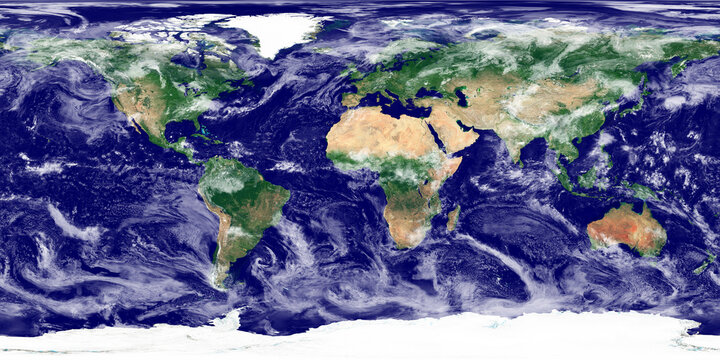
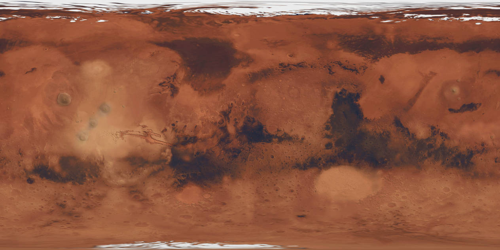
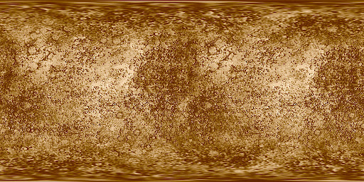
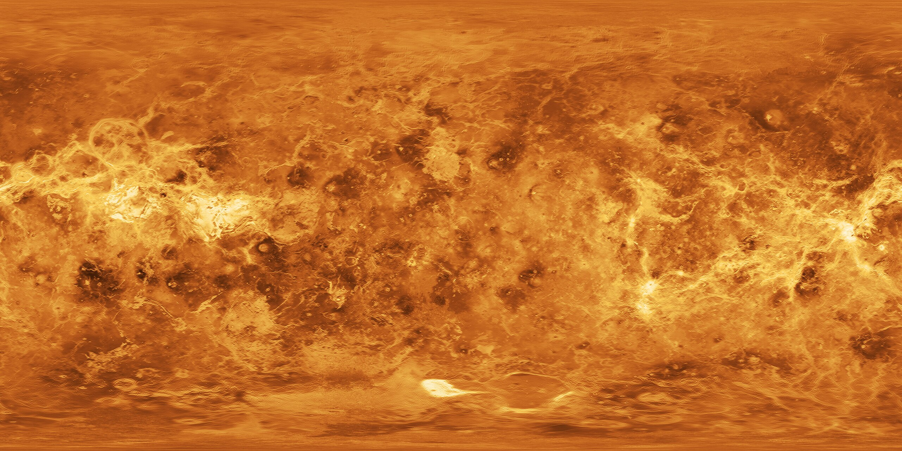

# 🌌 Solar System Simulation - OpenGL

This project showcases a 3D visualization of the solar system using OpenGL with C/C++. The goal was to create an interactive representation of celestial bodies, including the Sun, planets, and Saturn's rings. The project demonstrates OpenGL’s capabilities for dynamic and visually rich simulations, allowing users to explore planetary orbits and characteristics.

## Features

- **3D Visualization**: Realistic rendering of celestial bodies.
- **Interactive Exploration**: Navigate the solar system and zoom in/out.
- **Dynamic Animation**: Planetary orbits and movement simulation.
- **Textured Models**: Detailed textures for each planet and the Sun.
- **User Interaction**: Control views and animations with keyboard and mouse inputs.

## Demo

https://github.com/user-attachments/assets/7254833b-72d1-460c-934e-1b67b9a80d3d

## Getting Started

### Prerequisites

- CMake
- OpenGL
- A C++ compiler (e.g., GCC, Clang)

### Build and Run

To build and run the simulation, follow these steps:

```bash
cd build
cmake ..
cmake --build . && ../bin/main
```

## Controls

```sh
--------------------------------------
🌌 Solar System Simulation Commands 🌌
--------------------------------------
❌ Quit: press 'ESC'
🔄 Toggle orbits: press 'o'
🔍 Zoom in: press 'w'
🔎 Zoom out: press 's'
⏸️ Pause animation: press 'p'
🖱️ Move camera: press and hold the left mouse button and drag
🌐 View all elements: press 'A'
🌍 View individual element:
  0️⃣ SUN
  1️⃣ MERCURY
  2️⃣ VENUS
  3️⃣ EARTH
  4️⃣ MARS
  5️⃣ JUPITER
  6️⃣ SATURN
  7️⃣ URANUS
  8️⃣ NEPTUNE
--------------------------------------
```

## Textures

|Earth Texture|Jupiter Texture|Mars Texture|
|:-:|:-:|:-:|
||||

|Mercury Texture|Neptune Texture|Saturn Texture|
|:-:|:-:|:-:|
||||

|Sun Texture|Uranus Texture|Venus Texture|
|:-:|:-:|:-:|
||||

## License

This project is licensed under the MIT License. See the [LICENSE](LICENSE) file for details.
